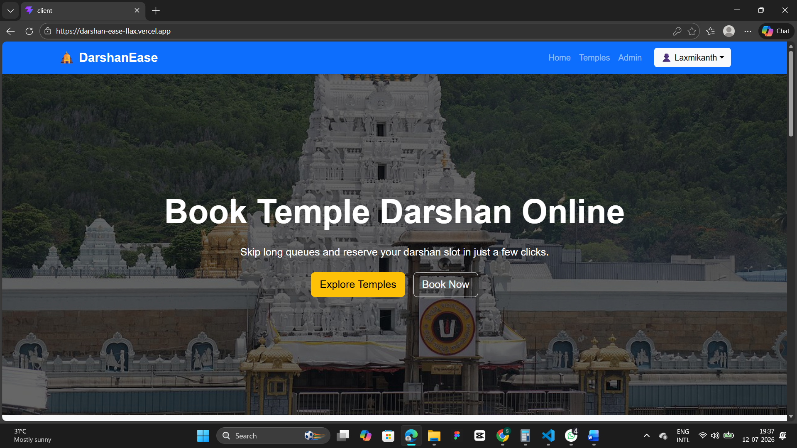
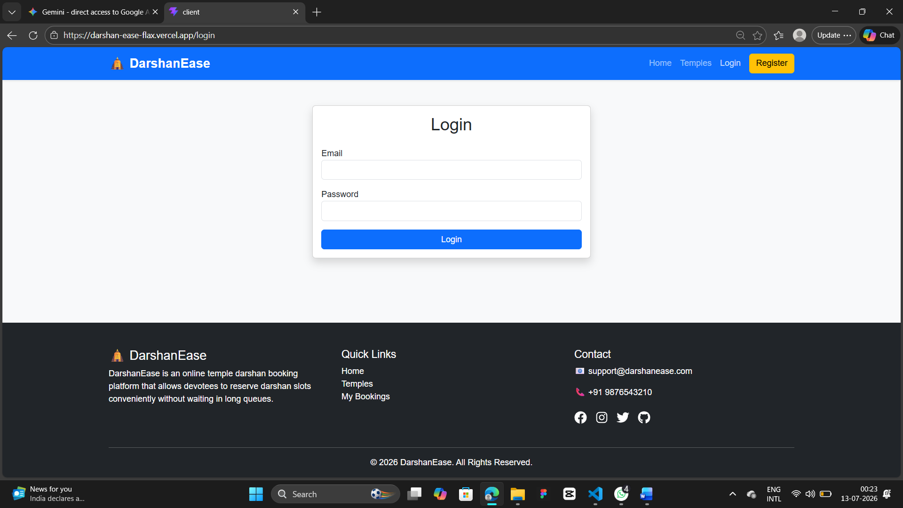
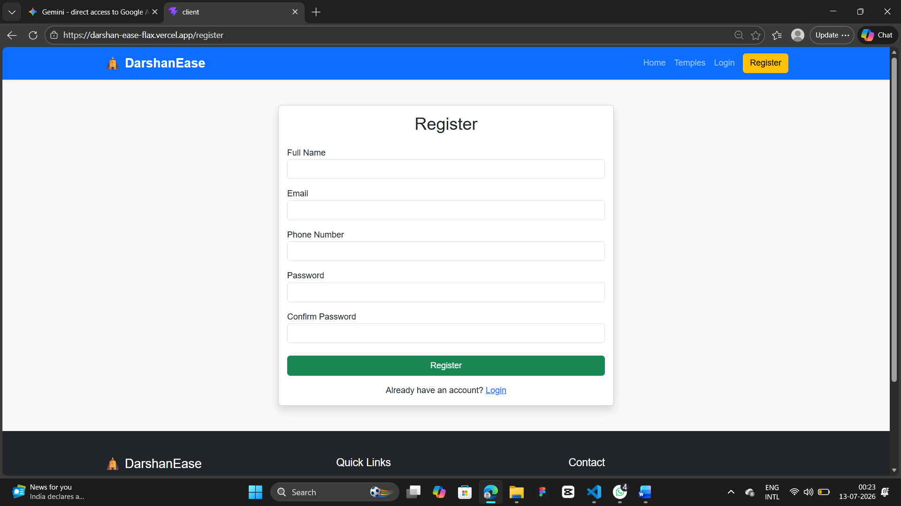
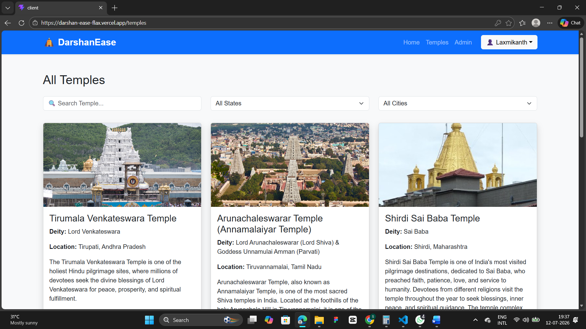
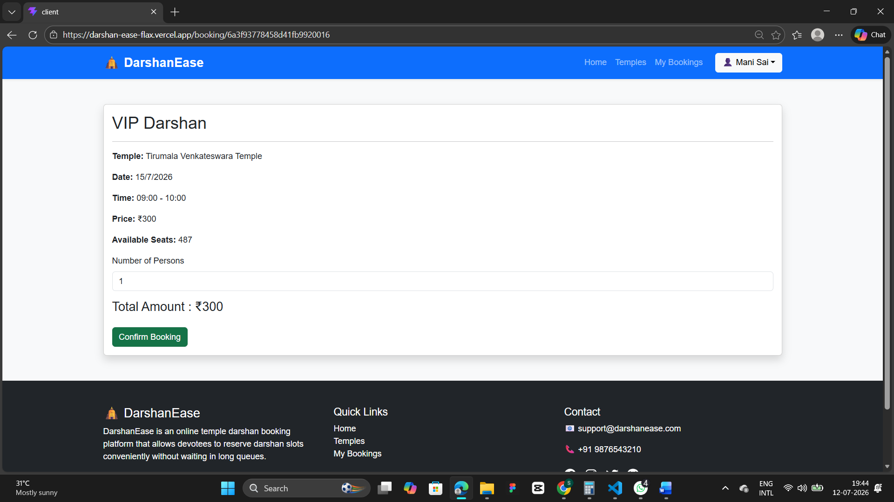
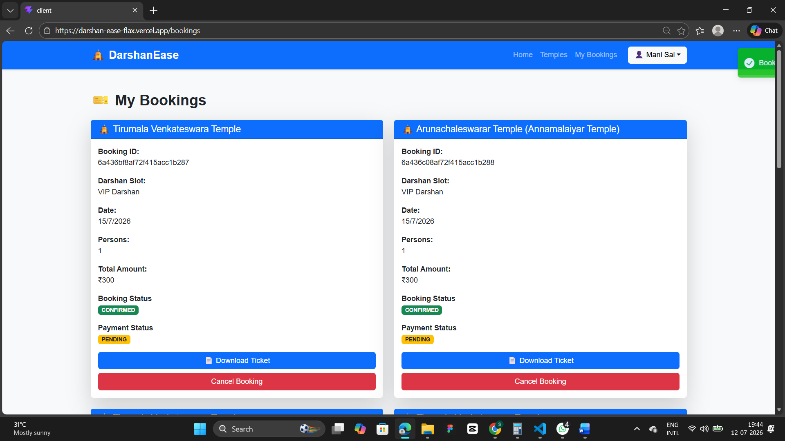
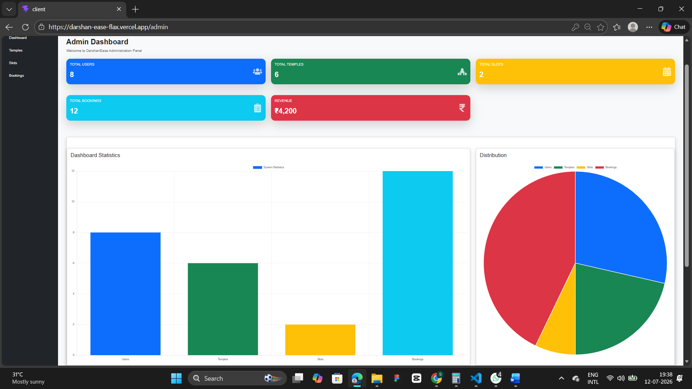

# 🛕 DarshanEase – Temple Darshan Booking System

<p align="center">


<br>


<br>


</p>

<p align="center">
<b>A Full Stack MERN Web Application for Smart Temple Darshan Booking</b>
</p>

<p align="center">
Digitizing the Temple Darshan Experience through Secure Online Booking, Real-Time Slot Management, and Efficient Administration.
</p>

---
## 📖 Overview

DarshanEase is a full-stack MERN web application designed to modernize the temple darshan booking process through a secure, scalable, and user-friendly digital platform.

The application allows devotees to explore temples, check available darshan slots, reserve tickets online, download booking confirmations, and manage their bookings conveniently from anywhere. It also provides a comprehensive administrative dashboard for managing temples, darshan slots, users, bookings, and system analytics.

---

# 🚀 Problem Statement

Traditional temple darshan booking systems often involve:

- Long waiting queues
- Manual ticket booking
- Limited visibility of slot availability
- Time-consuming administrative processes
- Inefficient booking management

These challenges lead to inconvenience for devotees and increased operational effort for temple authorities.

---

# 💡 Our Solution

DarshanEase digitizes the complete temple booking workflow through a secure online platform where devotees can browse temples, view real-time darshan slot availability, reserve tickets, download booking receipts, and manage bookings efficiently. The system also enables administrators to manage temples, slots, users, bookings, and platform statistics through a centralized dashboard.

---

# ✨ Features

## 👤 Devotee Features

- Secure User Registration & Login
- JWT Authentication
- Browse Available Temples
- Search & Filter Temples
- View Temple Details
- Real-Time Darshan Slot Availability
- Online Darshan Booking
- Booking Cancellation
- PDF Ticket Generation
- Booking History
- Responsive User Interface

---

## 👨‍💼 Administrator Features

- Secure Admin Login
- Dashboard Analytics
- Temple Management
- Darshan Slot Management
- Booking Management
- User Management
- Revenue Statistics
- System Reports

---

# 🛠️ Technology Stack

## Frontend

- React.js
- React Router DOM
- Bootstrap
- Axios
- React Toastify

## Backend

- Node.js
- Express.js
- JWT Authentication
- bcrypt.js
- Morgan
- CORS

## Database

- MongoDB Atlas
- Mongoose ODM

## Deployment

- Vercel (Frontend)
- Render (Backend)

## Development Tools

- Git
- GitHub
- Visual Studio Code
- Postman

---

# 🏗️ System Architecture

The application follows a modular MERN architecture consisting of:

- React.js Frontend
- REST API using Express.js
- MongoDB Atlas Database
- JWT Authentication
- Role-Based Authorization
- PDF Ticket Generation
- Cloud Deployment using Vercel & Render

---

# 📂 Project Structure

```
DarshanEase
│
├── client
│   ├── public
│   ├── src
│   └── package.json
│
├── server
│   ├── config
│   ├── controllers
│   ├── middleware
│   ├── models
│   ├── routes
│   ├── services
│   ├── validations
│   ├── utils
│   └── server.js
│
├── screenshots
│
└── README.md
```

---

# ⚙️ Installation Guide

## Clone Repository

```bash
git clone https://github.com/laxmikanthlalam/DarshanEase.git
```

```bash
cd DarshanEase
```

---

## Backend Setup

```bash
cd server
npm install
```

Create a `.env` file inside the **server** folder.

```env
PORT=5000

MONGODB_URI=YOUR_MONGODB_ATLAS_CONNECTION_STRING

JWT_SECRET=YOUR_SECRET_KEY

CLIENT_URL=http://localhost:5173
```

Run Backend

```bash
npm run dev
```

---

## Frontend Setup

```bash
cd client
npm install
```

Create a `.env` file inside the **client** folder.

```env
VITE_API_URL=http://localhost:5000/api
```

Run Frontend

```bash
npm run dev
```

---

# 🔐 Authentication & Security

- JWT Authentication
- Password Encryption using bcrypt
- Protected Routes
- Role-Based Authorization
- Secure REST APIs

---

# 📄 API Modules

### Authentication

- Register
- Login

### Users

- View Profile
- Update Profile

### Temples

- View Temples
- View Temple Details
- Manage Temples (Admin)

### Darshan Slots

- View Slots
- Add Slots
- Update Slots
- Delete Slots

### Bookings

- Book Darshan
- View Bookings
- Cancel Booking
- Download PDF Ticket

### Admin

- Dashboard
- Statistics
- Booking Management
- User Management

---

# 📸 Application Screenshots

> **Add screenshots inside the `screenshots` folder and update the image paths below.**

## 🏠 Home Page




## 🔐 Login




## 📝 Registration




## 🛕 Temple Listing




## 🎫 Booking Page




## 📄 My Bookings




## 📊 Admin Dashboard




# 🌍 Live Demo

## 🚀 Frontend

https://darshan-ease-flax.vercel.app/

---

## ⚙️ Backend API

https://darshanease-backend-e74x.onrender.com/

---

# 🔮 Future Enhancements

- Online Payment Gateway Integration
- QR Code Based Entry
- Email Notifications
- SMS Alerts
- AI-Based Crowd Prediction
- Temple Reviews & Ratings
- Multi-language Support
- Mobile Application

---

# 👥 Project Team

| Name | Role |
|------|------|
| **Laxmikanth Lalam** | Team Lead |
| **Medisetti Santosh** | Team Member |
| **Meerza Kaneez Kulsum** | Team Member |
| **Shankara Mani Sai Nookalamanthi** | Team Member |
| **Akhila Priya Nookarapu** | Team Member |

---

# 🤝 Contributing

Contributions are welcome.

1. Fork the repository
2. Create a feature branch
3. Commit your changes
4. Push the branch
5. Create a Pull Request

---

# ⭐ Show Your Support

If you found this project helpful,

⭐ Star this repository

🍴 Fork the repository

🛕 Share it with others

---

# 📜 License

This project was developed as part of the **APSSDC–SmartBridge Full Stack Development (MERN)** program for educational and learning purposes.

---

<p align="center">

### ⭐ Thank you for visiting DarshanEase ⭐

**Making Temple Darshan Booking Simple, Secure & Digital**

</p>
